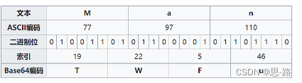

# BASE64

**什么是 base64?**

**Base64** 是一种基于64个可打印字符来表示二进制数据的表示方法。其产生目的是为了解决 单个byte无法满足单个字符表示的问题。（byte 可表示的范围（0-255），ASCII定义的范围（0-127）其中只有[95个可打印字符](http://www.wetools.com/ascii-table)）

Base64编码要求把3个8位字节（3\*8=24）转化为4个6位的字节（4\*6=24），之后在6位的前面补两个0，形成8位一个字节的形式。 如果剩下的字符不足3个字节，则用0填充，输出字符使用'='，因此编码后输出的文本末尾可能会出现1或2个'='。

为了保证所输出的编码位可读字符，Base64制定了一个编码表，以便进行统一转换。编码表的大小为2^6=64，这也是Base64名称的由来。在Base64中的可打印字符包括字母A-Z、a-z、数字0-9，这样共有62个字符

**示例**

在此例中，Base64算法将3个字节编码为4个字符。




[**标准映射表** ](https://datatracker.ietf.org/doc/html/rfc4648)

| 数值 | 字符 | 数值 | 字符 | 数值 | 字符 | 数值 | 字符 |
| --- | --- | --- | --- | --- | --- | --- | --- |
| 0 | A | 16 | Q | 32 | g | 48 | w |
| 1 | B | 17 | R | 33 | h | 49 | x |
| 2 | C | 18 | S | 34 | i | 50 | y |
| 3 | D | 19 | T | 35 | j | 51 | z |
| 4 | E | 20 | U | 36 | k | 52 | 0 |
| 5 | F | 21 | V | 37 | l | 53 | 1 |
| 6 | G | 22 | W | 38 | m | 54 | 2 |
| 7 | H | 23 | X | 39 | n | 55 | 3 |
| 8 | I | 24 | Y | 40 | o | 56 | 4 |
| 9 | J | 25 | Z | 41 | p | 57 | 5 |
| 10 | K | 26 | a | 42 | q | 58 | 6 |
| 11 | L | 27 | b | 43 | r | 59 | 7 |
| 12 | M | 28 | c | 44 | s | 60 | 8 |
| 13 | N | 29 | d | 45 | t | 61 | 9 |
| 14 | O | 30 | e | 46 | u | 62 | + |
| 15 | P | 31 | f | 47 | v | 63 | / |

**变种**

**URLBASE64**

base64传统编码中会出现+, /两个会被url直接转义的符号，因此 base64传统编码中会出现+, /两个会被url直接转义的符号，因此 URLBASE64 将62,63标准中的字符替换为 "-"，"\_"

[**MIMEBASE64**](https://datatracker.ietf.org/doc/html/rfc2045)X

在电子邮件中，根据[RFC 822](https://datatracker.ietf.org/doc/html/rfc822)规定，每76个字符，还需要加上一个回车换行。

**无用的知识**

1. base64 只是数据序列号算法，不是加密/压缩算法， 理论上编码后的数据比原始数据略长，为原来的4/3 (MIME 约为原长的135.1%)

1. 图片字符串保存

Data URI [RFC 2397](https://datatracker.ietf.org/doc/html/rfc2397)定义的一种把小文件直接嵌入文档的方案

data:[\<mediatype\>][;base64],\<data\>

```text
data:image/jpg;base64,/9j/4AAQSkZJRgABAQAAAQABAAD/4QAqRXhpZgAASUkqAAgAAAABADEBAgAHAAAAGgAAAAAAAABHb29nbGUAAP/bAIQAAwICAwICAwMDAwQDAwQFCAUFBAQFCgcHBggMCgwMCwoLCw0OEhANDhEOCwsQFhARExQVFRUMDxcYFhQYEhQVFAEDBAQFBAUKBQUJFA0LDhQVFBMUFBQUFBQSDxMVFBIRFBQQExMRFRQVFBUVExUREhQUFBQVFRIVEg8UFBQUFREV/8AAEQgAIAAgAwERAAIRAQMRAf/EABgAAAMBAQAAAAAAAAAAAAAAAAYHCAUJ/8QAKRAAAQQBAgUEAwEBAAAAAAAAAQIDBAURBhIABwgTIRQxMkEiJGFxFf/EABkBAAMBAQEAAAAAAAAAAAAAAAIEBQEDBv/EACoRAAECBAQFBAMAAAAAAAAAAAECAwARITEEEkHwE1FhcZEiwdHhQkOB/9oADAMBAAIRAxEAPwCYOUSa2DfxpN7pMaiTIAbhwnlqDIkbhtLqEkFQSPogpUcZxgZiKB/GMYQnMM9veOp+m9c10Sgua6lo6cXGnoipS9DQDENuplKR2lpjBeEdxO0oCylRCkZCcgcPlDgAIoIaHDtKEf1Ccy4EG7nGx0aawvVSTGt24pjPRVrSkKac9sHyhQSc/BXttGZmJddQSU3tvfaDWhpLJUB6tIjvl3bKd1KqHZBHecrX4vdASpPdW60QCtOdxIQokfw8NtqmJi3iJtdIHOUl1qmt5hae9OqJbvmaB6R9wIDoIIwFKThJA8j+hP8AOGQ3I2jA6kw/qPma3ovqhudZtXEsXU1aY1lDerz5bCdje9xOBtIaGw+TgY+iAwG33TJAn8Qa8Sxh0guGUzL+we9VGqlcx+V9UWEyKyWqaizZesIhZceCWnWwgJXhSdwcOFKTnKfiCQeE8Sj9JEyfHmOSsQDKQOvxaJk05oC+evaiel2O0Yx7ym0r7hVuOCSfODj6OSSDjODgQy8AEhP0N6fEDx03MYHL6JEc1LpxEa3AvZj6eyqNu2Qle4K8YJIAyQDjzt84J49AhGGab4jxzHkNO532MRlqxjr3DYTlSPyOvOQ33E4a0bQkufzQEDUmug36au/6AnvMqbdkOsuJJU0hKgErAIPsRgjCfBHGDEs8EqbbE7ffX2jucJiC/kddMic1OVss9NKipr3igObESq1V08W+poa5E56I/DcbkPHLwbQ8kKAUpJwDk5wPvicyQVZjWKmIbOT0UPO+/MT9VTvXXBl1Mkyg4wouxAyUvjBzuKQT8diz+JIwvJ2+3DGZIeDTRKhI2Bp35SrWo6zpEibiGeJiUhFZTmJEnkaGvIgHpYkT6Y+n67VzVg2+rL2LpKro1iYVTXB+4shaUttbgASCcqP0P98IIksqpI9YvghNAIw+qOXqfVfNW3c07VvSKeG6liPcsHYmSlLYKlICsfhlS8kZCgAQcDzgKBcwWYGsPvktqBTfQjruvu7iILuLHkIh1Qf7MxxSV720HzuKl+yQjOfrz4GgZgSDBlSZgXG+8Jewq59FFaplsFYTW+psLGFMTHlxnUpDv6y1ABbmcnZtGRn4fieF21KQrMlUjpuemkK8Pj5isekk3FCNZjWP/9k= 
```
